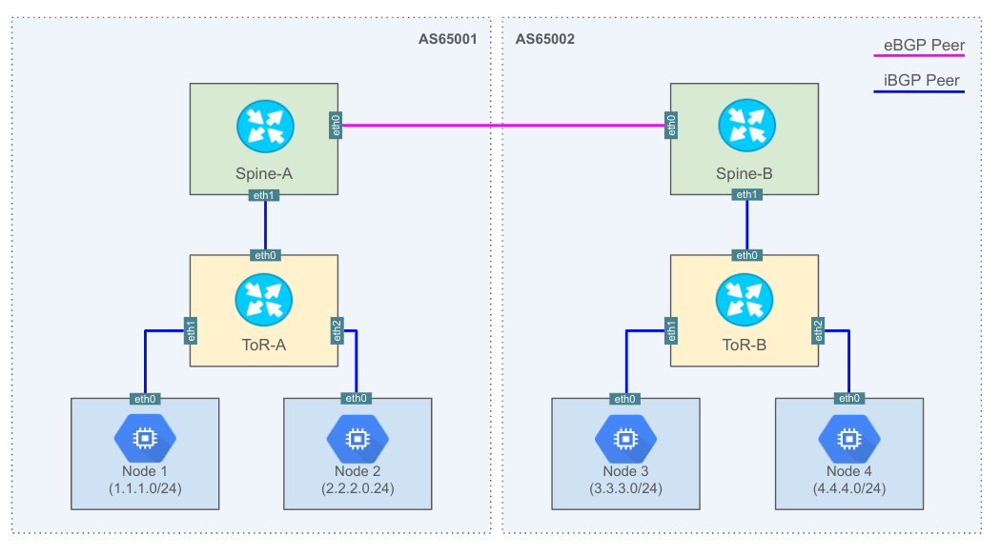
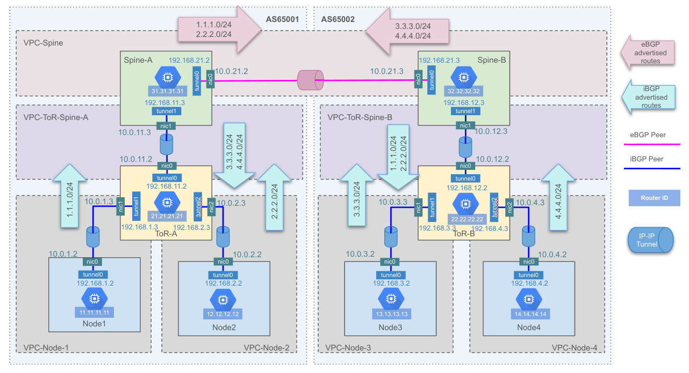

# Overview

This project is an example of running a mini
[clos](https://en.wikipedia.org/wiki/Clos_network)-like network using Network
Virtual Appliances(NVA) to exchange routes with BGP protocols within the GCP VPC
network.

# Objectives

This example is aiming to create a 3 layers connection as the below diagram.

In this example, all the nodes will have an overlay network advertised to the
routers via iBGP connection.

The Top or Rack routers(ToR) serves as the iBGP Route Reflector in their own AS.

On top of that, the spine routers will be exchanging BGP routes with eBGP
crossing the ASN boundry.

# Detailed design

In this example, NVA Cisco CSR is selected to provide the router function.

In order to build this network on a cloud platform, the "direct connected"
network can be simulated by Network Interface Cards(NICs) belonging to the same
Virtual Private Cloud(VPC). Where NVA Routers can be simulated by Multi-NIC VMs
running Cisco CSR images.

A caveat here is that, VPC networks in GCP, does not provide a Layer 2 network
functionality which makes the MAC address recongnizable by 2 directly connected
interfaces. In this case, an [IP in IP](https://en.wikipedia.org/wiki/IP_in_IP)
tunnel is required so that the network connection can function properly between
both sides of the BGP peers.

To conclude this, the detailed design becomes something similar to the below
diagram.

This repo provides the terraform configuration, together with the Cisco CSR
configurations according to the IP address assignment from the above diagram.
